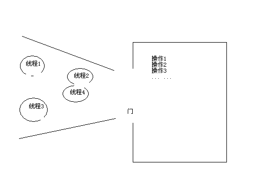
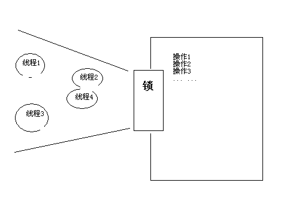
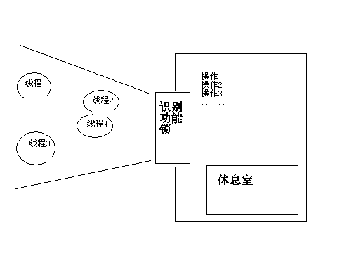
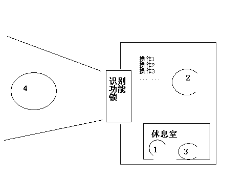

<!--{layout:default title:Java线程同步互斥}-->
> 本文是本人对java多线程之间同步和互斥的一些简单的个人理解，只是为了便于理解，并不是jvm内部实际实现

###线程互斥

多个线程需要用一些类动作来操作同一个共享数据，为了避免线程不可预料的先后顺序导致操作结果不确定，所以需要线程之间的互斥操作：

1.多线程如下图：

多个线程就像多个人要挤到一个房子里去进行一些列操作，如果没有互斥（不上锁），那么每个人都会进入房子里，甲进行了操作1，在操作2之前乙又进行了操作1，如果操作2依赖操作1，那么甲之后的操作就是错的了

2.互斥操作（加锁）

互斥操作就如同为房子加了一把锁，每一时刻只有一个人能够进到房子里，当进行完所有操作后，离开房子，再与其他人一起共同竞争这个一人的进入机会，这样保证操作序列的原子性
 
###线程同步
线程同步是为了保证多个线程之间有确定的先后顺序

接着：
2干完走人，4接着干，4干完后，会通知休息室：

* notify 方式通知：休息室会随机选一个线程将他丢到门外（比如1），而此时门外只有1，所以他必定进入房间【基本等于随机选一个人接着之前工作】，继续接着他上次的工作
* notifyAll通知：休息室将所有人一起丢到门外，让他们从新抢锁进房间，进入房间的接着上次工作做

如果使用Java5新增的Condition，则可以为锁建立多个休息室，比如生产者消费者问题中的 NotFullCondition  NotEmptyCondition

###信号量

java信号量（**Semaphore**）类似不止允许一个人进入的锁，可以用来控制并发总数，比如开始有6个人都在竞争进入房间（acquire()），当已经有三个进入房间后，其余的就会阻塞等待在门外，如果房间里有一个处理完毕（release()），那么房间外的就可以补充进来一个
当semaphore为1的信号量时，退化为普通的互斥锁

---------

相关文章：

* 下一篇:[Java Concurrent(一)::互斥同步](../2015-10-27/java_concurrent01.html)

