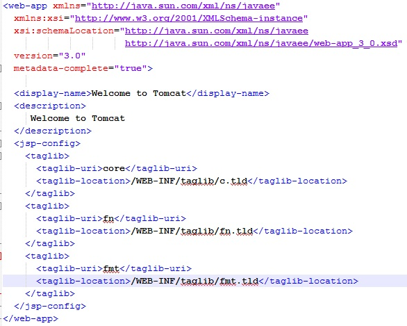
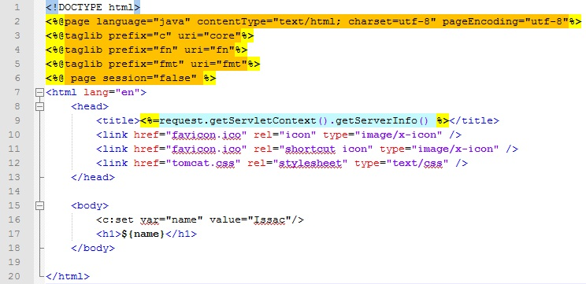
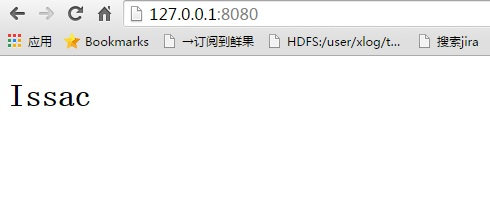
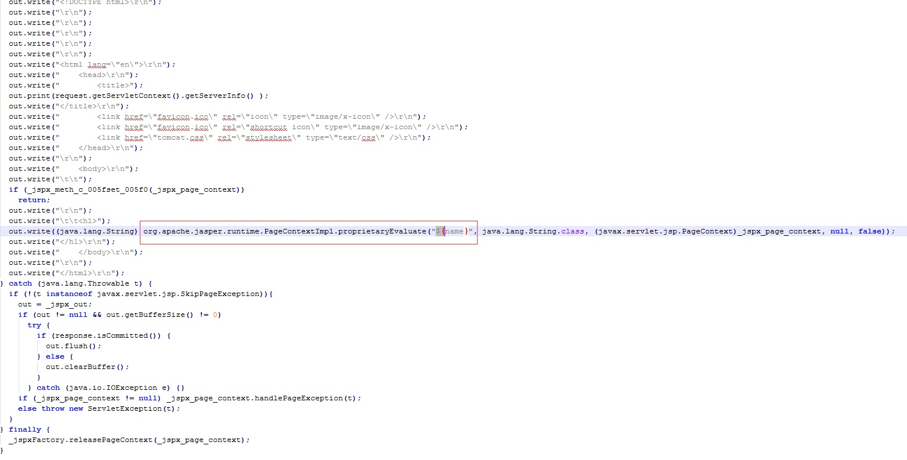
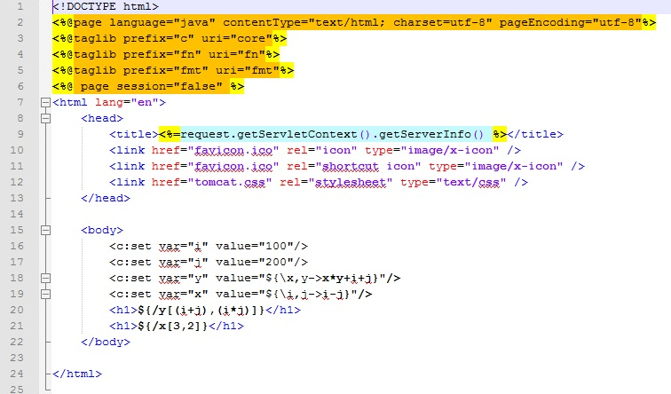
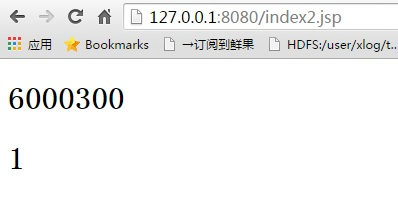

<!--{layout:default title:EL表达式支持Lambda}-->
前些天有同事发现同样的EL表达式在tomcat和resin容器下某些行为稍有不同(具体什么语句不太记得了,类似${false=="FALSE"}这样的语句结果不同)，于是抱着好奇心想去探究一下EL表达式到底是什么，同时平时接触的都是tomcat容器，那么就拿[tomcat的源码](http://apache.fayea.com/tomcat/tomcat-7/v7.0.63/src/apache-tomcat-7.0.63-src.zip)来研究下好了。

###在eclipse中启动tomcat
* **导入**:tomcat源码下有用于ant构建的build.xml,但是公司电脑上没装ant，就用了个最暴力的办法新建个eclipse项目，然后把源码目录下的java目录下的内容copy进新建的项目，同时为了项目运行正确，还需要把源码中的conf和webapps目录都copy到工程的根目录中。
* **启动**:tomcat的入口方法在
	<pre class="language-java line-numbers">
	<code>
	org.apache.catalina.startup.Bootstrap.main(String[])
	</code>
	</pre>
	找到这个Bootstrap类，然后run即可，这时打开浏览器输入127.0.0.1:8080就会看到熟悉的tomcat了
* 添加jstl支持，修改webapps/ROOT/WEB-INF/web.xml，添加如下内容：

* 同时copy一份taglib放到webapps/ROOT/WEB-INF/ 目录下
* 最终结果如下：

###寻找EL表达式代码
一个http请求过来之后，首先tomcat经过层层解析，最终会把封装好的Request和Response传递给JspServlet,然后将jsp编译成java代码
编译好的java代码可以在works里面看到，比如上面的jsp会生成如下源码：

可以看到这一步只是编译了jsp代码，对于EL表达式，是在
<pre class="language-java line-numbers">
<code>
org.apache.jasper.runtime.PageContextImpl.proprietaryEvaluate(String, Class<?>, PageContext, ProtectedFunctionMapper, boolean)
</code>
</pre>
这个方法里面获取EL表达式的值

EL表达式求值主要分为两步：

1. 解析EL表达式，生成AST(抽象语法树)，tomcat中使用JJTree&JavaCC生成的parser来从String中构建出org.apache.el.parser.Node的Tree
2. AST求值，从AST根节点开始递归调用各个Node的getValue方法，最终返回结果

###HOOK EL表达式
前些天看了些编译原理的书，于是突发奇想，如何才能让jsp中的EL表达式支持lambda呢，比如这样：

定义lambda的语法是以"\"开头，然后是参数列表，然后是"->"，最后是方法体

使用lambda的语法是以"/"开头，然后是lambda的identifier，参数放到"[]"里面 (其实最开始的想法是直接用f(param1,param2)这样的形式，但是tomcat在解析el表达式之前会对function做一次vailidate，这里用中括号就是为了避免这个validate，否则要改很多代码)

首先当然是要修改解析EL表达式生成AST的代码了，我们先定义两个新的节点类型,实现getValue方法，用来从AST中递归调用getValue获取最终结果：
<pre class="language-java line-numbers">
<code>
/**
 * AstLambda 表示一个定义lambda的语法树
 * children列表最后一项表示->右边的部分，第1~(length-2)项为lambda的参数列表
 */
public final class AstLambda extends SimpleNode {

	public AstLambda(int i) {
		super(i);
	}
	
	/**
	 * getValue直接返回节点对象本身，方便在未来被调用的时候使用
	 */
	@Override
	public Object getValue(EvaluationContext ctx) throws ELException {
		//throw new UnsupportedOperationException();
		return this;
	}
	
	/**
	 * 这里toString直接返回""
	 * 因为直接用${\x->x+1}不会在页面上输出内容（因为要用lambda，所以一般要在c:set 标签中定义lambda)
	 */
	@Override
	public String toString(){
		return "";
	}

}

/**
 * 表示调用lambda的语法树
 * children列表第1项表示引用lambda的identifier，后面为调用lambda传入的参数
 */
public final class AstInvoke extends SimpleNode {

	public AstInvoke(int i) {
		super(i);
	}
	
	/**
	 * 这里getValue首先从children[0]中获取定义lambda时放到pageContext中的AstLambda对象
	 * 然后从chidlren[1~(length-1)]中一次获取各个参数的AST，然后getValue并放到CTX的lambda的LambdaLocal中（这个也是个人自己加的，为了方便保存lambda的参数的作用域)
	 * 然后调用AstLambda.children[lenght-1].getValue()获取最终结果
	 */
	@Override
    public Object getValue(EvaluationContext ctx)
            throws ELException {
        Object obj1 = this.children[0].getValue(ctx);
        if(!(obj1 instanceof AstLambda)){
        	throw new ELException("Can not found Lambda in this context");
        }
        AstLambda lambda = (AstLambda)obj1;
        int length = lambda.children.length;
        if(length!=this.children.length){
        	throw new ELException("Params not match for Lambda");
        }
        Node body = lambda.children[length-1];
        //update ctx
        for(int i=1;i&lt;this.children.length;i++){
        	AstIdentifier identifier = (AstIdentifier)(lambda.children[i-1]);
        	String image = identifier.getImage();
        	ctx.setLambdaLocal(image, this.children[i].getValue(ctx));
        }
        Object ret =  body.getValue(ctx);
        //reload ctx
        ctx.clearLambdaLocal();
        return ret;
    }

}
</code>
</pre>

然后在org.apache.el.parser.ELParser列中加入用来构建Lambda相关节点的方法：

<pre class="language-java line-numbers">
<code>

/*
 * Unary For '-' '!' 'not' 'empty', then Value
 */
final public void Unary() throws ParseException {
	switch ((jj_ntk == -1) ? jj_ntk() : jj_ntk) {
	case MINUS:
		jj_consume_token(MINUS);
		AstNegative jjtn001 = new AstNegative(JJTNEGATIVE);
		boolean jjtc001 = true;
		jjtree.openNodeScope(jjtn001);
		try {
			Unary();
		} catch (Throwable jjte001) {
			if (jjtc001) {
				jjtree.clearNodeScope(jjtn001);
				jjtc001 = false;
			} else {
				jjtree.popNode();
			}
			if (jjte001 instanceof RuntimeException) {
				{
					if (true)
						throw (RuntimeException) jjte001;
				}
			}
			if (jjte001 instanceof ParseException) {
				{
					if (true)
						throw (ParseException) jjte001;
				}
			}
			{
				if (true)
					throw (Error) jjte001;
			}
		} finally {
			if (jjtc001) {
				jjtree.closeNodeScope(jjtn001, true);
			}
		}
		break;
	case NOT0:
	case NOT1:
		switch ((jj_ntk == -1) ? jj_ntk() : jj_ntk) {
		case NOT0:
			jj_consume_token(NOT0);
			break;
		case NOT1:
			jj_consume_token(NOT1);
			break;
		default:
			jj_la1[22] = jj_gen;
			jj_consume_token(-1);
			throw new ParseException();
		}
		AstNot jjtn002 = new AstNot(JJTNOT);
		boolean jjtc002 = true;
		jjtree.openNodeScope(jjtn002);
		try {
			Unary();
		} catch (Throwable jjte002) {
			if (jjtc002) {
				jjtree.clearNodeScope(jjtn002);
				jjtc002 = false;
			} else {
				jjtree.popNode();
			}
			if (jjte002 instanceof RuntimeException) {
				{
					if (true)
						throw (RuntimeException) jjte002;
				}
			}
			if (jjte002 instanceof ParseException) {
				{
					if (true)
						throw (ParseException) jjte002;
				}
			}
			{
				if (true)
					throw (Error) jjte002;
			}
		} finally {
			if (jjtc002) {
				jjtree.closeNodeScope(jjtn002, true);
			}
		}
		break;
	case EMPTY:
		jj_consume_token(EMPTY);
		AstEmpty jjtn003 = new AstEmpty(JJTEMPTY);
		boolean jjtc003 = true;
		jjtree.openNodeScope(jjtn003);
		try {
			Unary();
		} catch (Throwable jjte003) {
			if (jjtc003) {
				jjtree.clearNodeScope(jjtn003);
				jjtc003 = false;
			} else {
				jjtree.popNode();
			}
			if (jjte003 instanceof RuntimeException) {
				{
					if (true)
						throw (RuntimeException) jjte003;
				}
			}
			if (jjte003 instanceof ParseException) {
				{
					if (true)
						throw (ParseException) jjte003;
				}
			}
			{
				if (true)
					throw (Error) jjte003;
			}
		} finally {
			if (jjtc003) {
				jjtree.closeNodeScope(jjtn003, true);
			}
		}
		break;
	case INTEGER_LITERAL:
	case FLOATING_POINT_LITERAL:
	case STRING_LITERAL:
	case TRUE:
	case FALSE:
	case NULL:
	case LPAREN:
	case IDENTIFIER:
		Value();
		break;
	case LAMBDA:
		//声明lambda
		Lambda();
		break;
	case DIV0:
		//调用lambda
		Invoke();
		break;
	default:
		jj_la1[23] = jj_gen;
		jj_consume_token(-1);
		throw new ParseException();
	}
}
final public void Invoke() throws ParseException {
	jj_consume_token(DIV0);
	AstInvoke jjtn000 = new AstInvoke(JJTINVOKE);
	boolean jjtc000 = true;
	jjtree.openNodeScope(jjtn000);
	try{
		Identifier();
		jj_consume_token(LBRACK);
		InvokeParams();
		jj_consume_token(RBRACK);
	}catch(Throwable jjte000){
		if (jjtc000) {
			jjtree.clearNodeScope(jjtn000);
			jjtc000 = false;
		} else {
			jjtree.popNode();
		}
		if (jjte000 instanceof RuntimeException) {
			{
				if (true)
					throw (RuntimeException) jjte000;
			}
		}
		if (jjte000 instanceof ParseException) {
			{
				if (true)
					throw (ParseException) jjte000;
			}
		}
		{
			if (true)
				throw (Error) jjte000;
		}
	}finally{
		if(jjtc000){
			jjtree.closeNodeScope(jjtn000, jjtree.nodeArity()>1);
		}
	}
}

final public void Invoke() throws ParseException {
	jj_consume_token(DIV0);
	AstInvoke jjtn000 = new AstInvoke(JJTINVOKE);
	boolean jjtc000 = true;
	jjtree.openNodeScope(jjtn000);
	try{
		Identifier();
		jj_consume_token(LBRACK);
		InvokeParams();
		jj_consume_token(RBRACK);
	}catch(Throwable jjte000){
		if (jjtc000) {
			jjtree.clearNodeScope(jjtn000);
			jjtc000 = false;
		} else {
			jjtree.popNode();
		}
		if (jjte000 instanceof RuntimeException) {
			{
				if (true)
					throw (RuntimeException) jjte000;
			}
		}
		if (jjte000 instanceof ParseException) {
			{
				if (true)
					throw (ParseException) jjte000;
			}
		}
		{
			if (true)
				throw (Error) jjte000;
		}
	}finally{
		if(jjtc000){
			jjtree.closeNodeScope(jjtn000, jjtree.nodeArity()>1);
		}
	}
}
final public void InvokeParams() throws ParseException {
	Unary();
	try{
		jj_consume_token(COMMA);
		InvokeParams();
	}catch(ParseException e){
		}finally {
		}
}
/**
 * Lambda Defines Like \x->x+1
 * @throws ParseException
 */
final public void Lambda() throws ParseException {
	jj_consume_token(LAMBDA);
	// 定义
	AstLambda jjtn001 = new AstLambda(JJTLAMBDA);
	boolean jjtc001 = true;
	jjtree.openNodeScope(jjtn001);
	try {
		// params
		Params();
		jj_consume_token(MINUS);
		jj_consume_token(GT0);
		Expression();
		// invoke
	} catch (Throwable jjte001) {
		if (jjtc001) {
			jjtree.clearNodeScope(jjtn001);
			jjtc001 = false;
		} else {
			jjtree.popNode();
		}
		if (jjte001 instanceof RuntimeException) {
			{
				if (true)
					throw (RuntimeException) jjte001;
			}
		}
		if (jjte001 instanceof ParseException) {
			{
				if (true)
					throw (ParseException) jjte001;
			}
		}
		{
			if (true)
				throw (Error) jjte001;
		}
	} finally {
		if (jjtc001) {
			jjtree.closeNodeScope(jjtn001, jjtree.nodeArity() > 1);
		}
	}
}
final public void Params() throws ParseException {
	/* @bgen(jjtree) Identifier */
	Identifier();
	try{
		jj_consume_token(COMMA);
		Params();
	}catch(ParseException e){
		//pass
	}finally{
		
	}
}
</code>
</pre>

还要定义一些常量标识"\" "/"符号和AstLambda AstInvoke节点类型（这部分代码就贴出来了）

最终结果：

###总结：

1. EL表达式的解析还是比较简单的，直接生成抽象语法树，然后再在AST中递归求值
2. 修改JJTree&javaCC生成的代码太痛苦了，各种莫名其妙的变量命名~
3. EL表达式中定义的变量一般是在Context中取值的，为了便于给lambda传参数，在ctx中加入了一个新的map来保存参数名和值的映射
4. 只是觉得好玩才做的hook，lambda也不支持递归调用，总之是非常简单的尝试，用在生产肯定是不可能的了:)
5. 完整代码见[src.tar](../../attachments/2015-07-14/src.tar)
